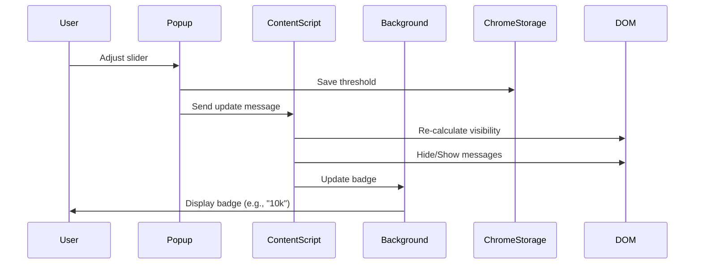

# Claude Leash - Technical Architecture

## Table of Contents
1. [System Architecture](#system-architecture)
2. [Component Deep Dive](#component-deep-dive)
3. [Data Flow](#data-flow)
4. [Performance Optimization](#performance-optimization)
5. [Session Management](#session-management)
6. [Container Detection Algorithm](#container-detection-algorithm)
7. [Message Hiding Implementation](#message-hiding-implementation)
8. [Extension Lifecycle](#extension-lifecycle)

---

## System Architecture

### High-Level Architecture

```
┌─────────────────────────────────────────────────────────────────┐
│                        Chrome Browser                            │
│  ┌──────────────────────────────────────────────────────────┐  │
│  │                   Extension Context                       │  │
│  │  ┌─────────────┐  ┌──────────────┐  ┌────────────────┐  │  │
│  │  │   Popup     │  │   Content    │  │   Background   │  │  │
│  │  │  (popup.*)  │  │ (content.js) │  │(background.js) │  │  │
│  │  │             │  │              │  │                │  │  │
│  │  │ - UI State  │  │ - DOM Manip  │  │ - Badge Mgmt   │  │  │
│  │  │ - Settings  │  │ - Detection  │  │ - Messaging    │  │  │
│  │  │ - Themes    │  │ - Caching    │  │                │  │  │
│  │  └──────┬──────┘  └──────┬───────┘  └───────┬────────┘  │  │
│  │         │                 │                  │           │  │
│  │         │    Messages     │     Messages     │           │  │
│  │         └─────────────────┼──────────────────┘           │  │
│  │                           │                              │  │
│  └───────────────────────────┼──────────────────────────────┘  │
│                              │                                 │
│  ┌───────────────────────────▼──────────────────────────────┐  │
│  │                    Web Page Context                       │  │
│  │  ┌────────────────────────────────────────────────────┐  │  │
│  │  │           claude.ai / code.anthropic.com           │  │  │
│  │  │                                                     │  │  │
│  │  │  ┌──────────────────────────────────────────────┐  │  │  │
│  │  │  │         React Application DOM                │  │  │  │
│  │  │  │  ┌────────────┐  ┌──────────────────────┐   │  │  │  │
│  │  │  │  │  Sidebar   │  │   Chat Container     │   │  │  │  │
│  │  │  │  │            │  │  ┌────────────────┐  │   │  │  │  │
│  │  │  │  │ - Nav      │  │  │ Message 1      │  │   │  │  │  │
│  │  │  │  │ - Settings │  │  │ Message 2      │  │   │  │  │  │
│  │  │  │  │ - History  │  │  │ ...            │  │   │  │  │  │
│  │  │  │  │            │  │  │ Message N      │  │   │  │  │  │
│  │  │  │  └────────────┘  │  └────────────────┘  │   │  │  │  │
│  │  │  │                  └──────────────────────┘   │  │  │  │
│  │  │  └──────────────────────────────────────────────┘  │  │  │
│  │  └─────────────────────────────────────────────────────┘  │  │
│  └─────────────────────────────────────────────────────────────┘  │
│                                                                   │
│  ┌─────────────────────────────────────────────────────────────┐ │
│  │                   Chrome Storage API                         │ │
│  │  ┌──────────────────────────────────────────────────────┐  │ │
│  │  │  Settings: threshold, toggles, theme, scale, debug   │  │ │
│  │  └──────────────────────────────────────────────────────┘  │ │
│  └─────────────────────────────────────────────────────────────┘ │
└─────────────────────────────────────────────────────────────────┘
```

### Component Interaction Diagram



---

## Component Deep Dive

### 1. Content Script (content.js) - ~1350 lines

**Primary Responsibilities:**
- Detect chat container and message elements
- Calculate cumulative message heights
- Hide/show messages based on threshold
- Manage session state and caching
- Handle SPA navigation detection
- Communicate with background script for badge updates
- **Performance metrics collection** (via PerformanceMonitor)
- **Storage migration** for version upgrades
- **IntersectionObserver-based progressive restore**

**Key Functions:**

```javascript
// Core Functions (content.js)

/**
 * Main entry point - detects platform and initializes
 * Location: content.js:1-50
 */
async function initialize() {
  // Platform detection (claude.ai vs code.anthropic.com)
  // Settings loading from Chrome Storage
  // Session detection setup
}

/**
 * Container detection with multi-strategy scoring
 * Location: content.js:200-350
 * Returns: Best container candidate or null
 */
function detectChatContainer() {
  // Strategy 1: overflow-y-auto class detection
  // Strategy 2: Scroll height analysis
  // Strategy 3: Viewport coverage calculation
  // Sidebar exclusion logic
  // Scoring and ranking
}

/**
 * Session ID extraction from URL
 * Location: content.js:400-450
 * Returns: Session ID string or null
 */
function extractSessionId() {
  // URL pathname parsing
  // Pattern matching for session identifiers
}

/**
 * Cache management for session data
 * Location: content.js:600-700
 * Structure: Map<sessionId, {contentParent, messageChildren, cachedHeights}>
 */
const sessionCache = new Map();

/**
 * Message visibility calculation and hiding
 * Location: content.js:800-900
 */
async function updateMessageVisibility(threshold) {
  // Get or detect container
  // Calculate heights from bottom-up
  // Determine hide point
  // Apply CSS display:none
  // Create placeholder
  // Update badge
}

/**
 * SPA navigation detection
 * Location: content.js:900-1000
 */
function setupNavigationDetection() {
  // Hook History API (pushState, replaceState)
  // Listen for popstate events
  // Fallback polling (300ms interval)
  // Trigger session change handler
}

/**
 * MutationObserver for early intervention
 * Location: content.js:100-200
 */
const observer = new MutationObserver((mutations) => {
  // Detect new message additions
  // Trigger immediate hiding if needed
  // Prevent layout thrashing
});
```

**State Management:**
```javascript
// Global state in content.js
let currentSessionId = null;
let abortController = new AbortController();
let lastKnownSettings = {};
let debugMode = false;
let platformType = 'unknown'; // 'claudeAI' | 'claudeCode'
```

**Performance Optimizations:**
1. **Session caching**: Avoid re-detecting containers on revisit
2. **AbortController**: Cancel operations on session change
3. **requestIdleCallback**: Wait for React hydration
4. **Debouncing**: Prevent excessive re-calculations
5. **CSS-only hiding**: `display:none` for instant hide, no reflow
6. **PerformanceMonitor**: Tracks FPS, latencies, and session switch times
7. **IntersectionObserver**: Smooth progressive restore when placeholder visible

**PerformanceMonitor Class:**
```javascript
const perfMonitor = {
  metrics: {
    fps: [],              // Frame rate measurements
    hideLatency: [],      // Time to hide messages
    restoreLatency: [],   // Time to restore messages
    containerDetectionTime: [], // Container detection time
    sessionSwitchTime: [] // Full session switch time
  },

  startTimer(metricType) { /* returns {complete: () => duration} */ },
  measureFPS(duration) { /* records FPS over duration */ },
  getStats(metricType) { /* returns {mean, median, p95, p99, min, max} */ },
  exportMetrics() { /* returns JSON for download */ }
};
```

**Storage Versioning:**
```javascript
const STORAGE_VERSION = 1;

async function migrateStorageIfNeeded() {
  // Handles maxLines -> maxHeight conversion
  // Future migrations can be added for breaking changes
}
```

---

### 2. Popup UI (popup.html + popup.js) - ~350 lines

**Primary Responsibilities:**
- Render user interface with settings controls
- Manage theme switching (light/dark/auto)
- Handle user input and validation
- Persist settings to Chrome Storage
- Communicate updates to content script
- **First-time user onboarding tip** (dismissable)
- **Debug tools** (metrics export, FPS measurement)

**UI Components:**

```html
<!-- popup.html structure -->
<div class="popup-container">
  <!-- Header -->
  <div class="header">
    <h1>Claude Leash</h1>
    <span class="version">v3.4.10</span>
  </div>

  <!-- Platform Toggles -->
  <div class="platform-toggles">
    <label>
      <input type="checkbox" id="claudeCodeToggle">
      Claude Code
    </label>
    <label>
      <input type="checkbox" id="claudeAIToggle">
      Claude.ai
    </label>
  </div>

  <!-- Threshold Slider -->
  <div class="threshold-control">
    <label>Visible Amount: <span id="thresholdValue">10k</span></label>
    <input type="range" id="thresholdSlider" min="4000" max="40000" step="1000">
  </div>

  <!-- Collapse Toggle -->
  <button id="collapseToggle">Collapse / Show All</button>

  <!-- HiDPI Scale Factor -->
  <div class="scale-control">
    <label>HiDPI Scale: <span id="scaleValue">1.0x</span></label>
    <input type="range" id="scaleSlider" min="1" max="3" step="0.1">
  </div>

  <!-- Theme Selector -->
  <div class="theme-control">
    <label>Theme:</label>
    <select id="themeSelect">
      <option value="auto">Auto</option>
      <option value="light">Light</option>
      <option value="dark">Dark</option>
    </select>
  </div>

  <!-- Debug Mode -->
  <label>
    <input type="checkbox" id="debugMode">
    Debug Mode
  </label>

  <!-- Debug Tools (visible when debug enabled) -->
  <div id="debugTools" class="hidden">
    <button id="scanDOM">Scan DOM</button>
    <button id="highlightContainer">Highlight Container</button>
  </div>
</div>
```

**Key Functions (popup.js):**

```javascript
/**
 * Load settings from Chrome Storage on popup open
 * Location: popup.js:1-50
 */
async function loadSettings() {
  const settings = await chrome.storage.local.get([
    'collapseThreshold',
    'isCollapsed',
    'hiDPIScaleFactor',
    'interfaceToggles',
    'theme',
    'debugMode'
  ]);

  // Apply defaults if missing
  // Update UI controls
}

/**
 * Save settings to Chrome Storage
 * Location: popup.js:50-100
 */
async function saveSettings(key, value) {
  await chrome.storage.local.set({ [key]: value });

  // Notify content script of change
  const [tab] = await chrome.tabs.query({ active: true, currentWindow: true });
  chrome.tabs.sendMessage(tab.id, { type: 'settingsUpdated', key, value });
}

/**
 * Theme application
 * Location: popup.js:150-200
 */
function applyTheme(theme) {
  if (theme === 'auto') {
    const prefersDark = window.matchMedia('(prefers-color-scheme: dark)').matches;
    document.body.classList.toggle('dark-theme', prefersDark);
  } else {
    document.body.classList.toggle('dark-theme', theme === 'dark');
  }
}

/**
 * Event listeners setup
 * Location: popup.js:200-280
 */
document.addEventListener('DOMContentLoaded', () => {
  loadSettings();

  // Slider input
  thresholdSlider.addEventListener('input', (e) => {
    const value = parseInt(e.target.value);
    thresholdValue.textContent = formatBytes(value);
    saveSettings('collapseThreshold', value);
  });

  // Platform toggles
  claudeCodeToggle.addEventListener('change', (e) => {
    saveSettings('interfaceToggles', { ...toggles, claudeCode: e.target.checked });
  });

  // Theme selector
  themeSelect.addEventListener('change', (e) => {
    saveSettings('theme', e.target.value);
    applyTheme(e.target.value);
  });

  // Debug tools
  scanDOM.addEventListener('click', () => {
    chrome.tabs.sendMessage(tabId, { type: 'scanDOM' });
  });
});
```

---

### 3. Background Service Worker (background.js) - 66 lines

**Primary Responsibilities:**
- Update extension badge text and color
- Handle cross-component messaging
- Respond to tab activation events

**Key Functions:**

```javascript
/**
 * Message listener for badge updates
 * Location: background.js:1-40
 */
chrome.runtime.onMessage.addListener((message, sender, sendResponse) => {
  if (message.type === 'updateBadge') {
    const { text, color, tabId } = message.data;

    chrome.action.setBadgeText({ text, tabId });
    chrome.action.setBadgeBackgroundColor({ color, tabId });
  }
});

/**
 * Tab activation handler
 * Location: background.js:40-66
 */
chrome.tabs.onActivated.addListener(async (activeInfo) => {
  // Request current state from content script
  chrome.tabs.sendMessage(activeInfo.tabId, { type: 'requestBadgeUpdate' });
});

/**
 * Extension icon click handler (opens popup)
 * Default behavior - no custom handler needed
 */
```

**Badge Color Logic:**
```javascript
// Badge colors by platform
const BADGE_COLORS = {
  claudeAI: '#3b82f6',    // Blue
  claudeCode: '#10b981',  // Green
  disabled: '#6b7280'     // Gray
};
```

---

## Data Flow

### Settings Update Flow

```
┌──────────┐
│   User   │
└────┬─────┘
     │ 1. Adjusts slider
     ▼
┌──────────────┐
│   Popup.js   │
└────┬─────────┘
     │ 2. Save to Storage
     ▼
┌─────────────────────┐
│ Chrome Storage API  │
└────┬────────────────┘
     │ 3. storage.onChanged event
     ▼
┌──────────────────┐
│   Content.js     │
└────┬─────────────┘
     │ 4. Re-calculate visibility
     ▼
┌──────────────────┐
│    Claude DOM    │
└──────────────────┘
```

### Badge Update Flow

```
┌──────────────────┐
│   Content.js     │
│ (detects change) │
└────┬─────────────┘
     │ 1. chrome.runtime.sendMessage
     ▼
┌──────────────────┐
│  Background.js   │
└────┬─────────────┘
     │ 2. chrome.action.setBadgeText
     │    chrome.action.setBadgeBackgroundColor
     ▼
┌──────────────────┐
│  Extension Icon  │
│   Badge: "10k"   │
└──────────────────┘
```

### Session Change Flow

```
┌──────────────────┐
│   User clicks    │
│  new conversation│
└────┬─────────────┘
     │ 1. History API (pushState)
     ▼
┌──────────────────┐
│   Content.js     │
│ (hooks detect)   │
└────┬─────────────┘
     │ 2. Extract new session ID
     ▼
┌──────────────────┐
│ Session Cache    │
│ (check for entry)│
└────┬─────────────┘
     │ 3a. Cache HIT         3b. Cache MISS
     ▼                       ▼
┌──────────────────┐    ┌──────────────────┐
│ Use cached data  │    │ Detect container │
│ Fast restore     │    │ Build new cache  │
└────┬─────────────┘    └────┬─────────────┘
     │                        │
     └────────┬───────────────┘
              │ 4. Apply visibility
              ▼
┌──────────────────────────────┐
│ Hide messages > threshold    │
│ Update badge                 │
└──────────────────────────────┘
```

---

## Performance Optimization

### 1. DOM Query Optimization

**Problem:** Repeated `querySelectorAll` calls are expensive.

**Solution:**
```javascript
// Cache container reference
let cachedContainer = null;

function getContainer() {
  if (cachedContainer && document.contains(cachedContainer)) {
    return cachedContainer;
  }
  cachedContainer = detectChatContainer();
  return cachedContainer;
}
```

### 2. Height Calculation Batching

**Problem:** Reading `offsetHeight` triggers layout reflows.

**Solution:**
```javascript
// Batch all reads, then all writes
const heights = [];
for (const msg of messages) {
  heights.push(msg.offsetHeight); // Read phase
}

let cumulativeHeight = 0;
for (let i = messages.length - 1; i >= 0; i--) {
  cumulativeHeight += heights[i];
  if (cumulativeHeight > threshold) {
    messages[i].style.display = 'none'; // Write phase
  }
}
```

### 3. CSS-Only Hiding

**Why:** JavaScript-driven animations cause jank.

**Implementation:**
```javascript
// Instant hide with CSS
element.style.display = 'none';

// Alternative: CSS class toggle (with pre-defined .hidden class)
element.classList.add('claude-leash-hidden');
```

```css
.claude-leash-hidden {
  display: none !important;
}
```

### 4. MutationObserver Throttling

**Problem:** High-frequency mutations (e.g., typing indicator) trigger excessive callbacks.

**Solution:**
```javascript
let mutationTimer = null;

const observer = new MutationObserver((mutations) => {
  clearTimeout(mutationTimer);
  mutationTimer = setTimeout(() => {
    handleMutations(mutations);
  }, 100); // 100ms debounce
});
```

### 5. Session Cache Strategy

**Cache Structure:**
```javascript
const sessionCache = new Map();

// Cache entry
{
  sessionId: 'abc123',
  data: {
    contentParent: DOMElement,       // Container reference
    messageChildren: [...],           // Array of message elements
    cachedHeights: [120, 85, 200...], // Pre-calculated heights
    threshold: 10000,                 // Threshold at cache time
    timestamp: Date.now()             // For cache invalidation
  }
}
```

**Cache Invalidation:**
- Session switch (different URL)
- Container not in DOM (React re-render)
- 30-second timeout (prevents stale data)

### 6. AbortController for Cancellation

**Problem:** Async operations continue after navigation.

**Solution:**
```javascript
let abortController = new AbortController();

async function longOperation() {
  try {
    await someAsyncTask({ signal: abortController.signal });
  } catch (error) {
    if (error.name === 'AbortError') {
      console.log('Operation cancelled');
    }
  }
}

// On session change
abortController.abort();
abortController = new AbortController();
```

---

## Session Management

### Session Detection

**URL Patterns:**

| Platform | URL Pattern | Session ID Location |
|----------|-------------|---------------------|
| Claude.ai | `https://claude.ai/chat/{sessionId}` | pathname.split('/')[2] |
| Claude Code | `https://code.anthropic.com/project/{sessionId}` | pathname.split('/')[2] |

**Detection Logic:**
```javascript
function extractSessionId() {
  const pathname = window.location.pathname;

  // Claude.ai: /chat/abc123
  if (pathname.startsWith('/chat/')) {
    return pathname.split('/')[2];
  }

  // Claude Code: /project/xyz789
  if (pathname.startsWith('/project/')) {
    return pathname.split('/')[2];
  }

  return null;
}
```

### Navigation Hooks

**History API Hooking:**
```javascript
const originalPushState = history.pushState;
const originalReplaceState = history.replaceState;

history.pushState = function(...args) {
  originalPushState.apply(this, args);
  handleSessionChange();
};

history.replaceState = function(...args) {
  originalReplaceState.apply(this, args);
  handleSessionChange();
};

window.addEventListener('popstate', handleSessionChange);
```

**Polling Fallback:**
```javascript
let lastSessionId = null;

setInterval(() => {
  const currentSessionId = extractSessionId();
  if (currentSessionId !== lastSessionId) {
    lastSessionId = currentSessionId;
    handleSessionChange();
  }
}, 300); // Check every 300ms
```

---

## Container Detection Algorithm

### Multi-Strategy Scoring System

**Strategy 1: CSS Class Detection**
```javascript
// Look for overflow containers
const candidates = document.querySelectorAll('[class*="overflow-y-auto"]');
```

**Strategy 2: Scroll Height Analysis**
```javascript
function calculateScrollScore(element) {
  const scrollHeight = element.scrollHeight;
  const clientHeight = element.clientHeight;

  // Higher score for elements with significant scroll
  if (scrollHeight > clientHeight * 2) {
    return 10;
  } else if (scrollHeight > clientHeight) {
    return 5;
  }
  return 0;
}
```

**Strategy 3: Viewport Coverage**
```javascript
function calculateViewportScore(element) {
  const rect = element.getBoundingClientRect();
  const viewportHeight = window.innerHeight;

  // Higher score for elements covering most of viewport
  const coverage = (rect.height / viewportHeight) * 100;

  if (coverage > 80) return 10;
  if (coverage > 50) return 5;
  return 0;
}
```

**Sidebar Exclusion:**
```javascript
function isSidebar(element) {
  const computedStyle = getComputedStyle(element);

  // Strategy 1: Check flex-shrink
  if (computedStyle.flexShrink === '0') {
    return true;
  }

  // Strategy 2: Check width
  const width = element.offsetWidth;
  if (width > 0 && width < 400) {
    return true;
  }

  // Strategy 3: Check positioning
  const rect = element.getBoundingClientRect();
  if (rect.left < 50) { // Left-aligned, narrow
    return true;
  }

  return false;
}
```

**Final Scoring:**
```javascript
function scoreCandidate(element) {
  if (isSidebar(element)) return -1000; // Exclude

  let score = 0;
  score += calculateScrollScore(element);
  score += calculateViewportScore(element);
  score += element.children.length > 5 ? 5 : 0; // Bonus for many children

  return score;
}

// Select best candidate
const best = candidates.reduce((prev, curr) => {
  return scoreCandidate(curr) > scoreCandidate(prev) ? curr : prev;
});
```

---

## Message Hiding Implementation

### Height Calculation (Bottom-Up)

```javascript
async function updateMessageVisibility(threshold) {
  const container = getContainer();
  if (!container) return;

  const messages = Array.from(container.children);
  const heights = messages.map(msg => msg.offsetHeight);

  let cumulativeHeight = 0;
  let hideIndex = -1;

  // Start from bottom (most recent)
  for (let i = messages.length - 1; i >= 0; i--) {
    cumulativeHeight += heights[i];

    if (cumulativeHeight > threshold) {
      hideIndex = i;
      break;
    }
  }

  // Hide older messages
  if (hideIndex > 0) {
    for (let i = 0; i < hideIndex; i++) {
      messages[i].style.display = 'none';
      messages[i].classList.add('claude-leash-hidden');
    }

    // Create placeholder
    createPlaceholder(container, hideIndex);
  }

  // Update badge
  updateBadge(cumulativeHeight);
}
```

### Placeholder Creation

```javascript
function createPlaceholder(container, hideCount) {
  // Remove existing placeholder
  const existing = container.querySelector('.claude-leash-placeholder');
  if (existing) existing.remove();

  // Create new placeholder
  const placeholder = document.createElement('div');
  placeholder.className = 'claude-leash-placeholder';
  placeholder.textContent = `${hideCount} older messages hidden. Click to show.`;

  placeholder.addEventListener('click', () => {
    showAllMessages();
  });

  // Insert at top of container
  container.insertBefore(placeholder, container.firstChild);
}
```

### Progressive Unhiding (Scroll-Based)

```javascript
let scrollTimeout = null;

container.addEventListener('scroll', () => {
  clearTimeout(scrollTimeout);

  scrollTimeout = setTimeout(() => {
    const scrollTop = container.scrollTop;

    // If scrolled to top, show more messages
    if (scrollTop < 100) {
      const hidden = container.querySelectorAll('.claude-leash-hidden');

      // Show 5 more messages
      for (let i = hidden.length - 1; i >= Math.max(0, hidden.length - 5); i--) {
        hidden[i].style.display = '';
        hidden[i].classList.remove('claude-leash-hidden');
      }

      // Update placeholder count
      updatePlaceholder();
    }
  }, 150); // Debounce 150ms
});
```

---

## Extension Lifecycle

### Installation

```javascript
chrome.runtime.onInstalled.addListener((details) => {
  if (details.reason === 'install') {
    // Set default settings
    chrome.storage.local.set({
      collapseThreshold: 10000,
      isCollapsed: true,
      hiDPIScaleFactor: 1.0,
      interfaceToggles: {
        claudeCode: true,
        claudeAI: true
      },
      theme: 'auto',
      debugMode: false
    });

    // Open welcome page (optional)
    // chrome.tabs.create({ url: 'welcome.html' });
  }

  if (details.reason === 'update') {
    // Migration logic for breaking changes
    const oldVersion = details.previousVersion;
    const newVersion = chrome.runtime.getManifest().version;

    console.log(`Updated from ${oldVersion} to ${newVersion}`);
  }
});
```

### Content Script Injection

**Automatic (via manifest.json):**
```json
{
  "content_scripts": [{
    "matches": [
      "*://claude.ai/*",
      "*://code.anthropic.com/*"
    ],
    "js": ["content.js"],
    "run_at": "document_idle",
    "all_frames": false
  }]
}
```

**Run Timing:**
- `document_idle`: After DOMContentLoaded, before window.onload
- Ensures DOM is ready but allows React hydration to complete first

### Background Service Worker Lifecycle

**Manifest V3 Service Workers:**
- Event-driven, not persistent
- Automatically shut down when idle
- Reactivated on events (messages, alarms, tab changes)

**State Persistence:**
```javascript
// DO NOT store state in global variables
// Service worker can be terminated at any time

// ❌ Bad
let badgeCache = {};

// ✅ Good
async function getBadgeState(tabId) {
  const result = await chrome.storage.session.get(`badge_${tabId}`);
  return result[`badge_${tabId}`];
}
```

---

## Security Considerations

### Content Security Policy

**No Inline Scripts:**
- All JavaScript in external files (content.js, popup.js, background.js)
- No `eval()` or `new Function()`
- No inline event handlers (e.g., `<button onclick="...">`)

**Permissions Minimization:**
```json
{
  "permissions": [
    "storage",      // Required for settings
    "activeTab"     // Required for messaging
  ],
  "host_permissions": [
    "*://claude.ai/*",
    "*://code.anthropic.com/*"
  ]
}
```

### XSS Prevention

**User Input Sanitization:**
```javascript
// When creating DOM elements with user data
const placeholder = document.createElement('div');
placeholder.textContent = userString; // ✅ Safe (textContent escapes HTML)

// ❌ Unsafe
placeholder.innerHTML = userString; // Allows XSS
```

### Data Privacy

- **No external requests**: All logic runs locally
- **No telemetry**: No analytics, tracking, or error reporting to external servers
- **Local storage only**: Chrome Storage API (synced to user account, not cloud servers)

---

## Debugging & Troubleshooting

### Debug Mode Features

When `debugMode` is enabled:

```javascript
if (debugMode) {
  console.log('[Claude Leash DEBUG] Container candidates:', candidates);
  console.log('[Claude Leash DEBUG] Selected container:', selectedContainer);
  console.log('[Claude Leash DEBUG] Message heights:', heights);
  console.log('[Claude Leash DEBUG] Cumulative height:', cumulativeHeight);
  console.log('[Claude Leash DEBUG] Hide index:', hideIndex);
}
```

### DOM Scanner

**Purpose:** Visualize container detection process

```javascript
function scanDOM() {
  const candidates = document.querySelectorAll('[class*="overflow-y-auto"]');

  candidates.forEach((el, idx) => {
    const score = scoreCandidate(el);
    const isSidebarEl = isSidebar(el);

    console.log(`Candidate ${idx}:`, {
      element: el,
      score,
      isSidebar: isSidebarEl,
      scrollHeight: el.scrollHeight,
      clientHeight: el.clientHeight,
      children: el.children.length
    });

    // Highlight element
    el.style.outline = score > 10 ? '3px solid green' : '1px solid orange';
  });
}
```

### Common Issues

| Symptom | Likely Cause | Debug Steps |
|---------|--------------|-------------|
| Extension not working | Wrong URL pattern | Check `window.location.href` matches manifest |
| Container not detected | CSS class changed | Enable debug mode, run DOM scanner |
| Messages reappear | React hydration | Check `requestIdleCallback` timing |
| Badge not updating | Message passing failure | Check background.js service worker console |
| High CPU usage | Observer firing too often | Check mutation throttling logic |

---

## Future Architecture Considerations

### Implemented Optimizations

1. **Intersection Observer for Visibility:** ✅ IMPLEMENTED
   - More efficient than scroll event listening
   - Progressive loading based on viewport proximity
   - Triggers when placeholder becomes visible

2. **Performance Monitoring:** ✅ IMPLEMENTED
   - FPS measurement during scrolling
   - Latency tracking for hide/restore operations
   - Exportable metrics for debugging and showcasing

### Potential Future Optimizations

1. **Web Worker for Height Calculations:**
   - Offload heavy computation to background thread
   - Requires serializable data (no DOM references)

2. **Virtual Scrolling:**
   - Only render visible messages in DOM
   - Requires significant refactoring of Claude's UI

3. **IndexedDB for Larger Caches:**
   - Chrome Storage has 10MB limit
   - IndexedDB allows larger cached datasets

### Scalability

**Current Limitations:**
- Designed for 100-500 message conversations
- Performance degrades with 1000+ messages
- O(n) height calculation on each update

**Potential Solutions:**
- Incremental updates (only recalculate changed messages)
- Binary search for hide index
- Lazy height calculation (calculate on scroll)

---

**Document Version:** 1.0
**Last Updated:** 2025-12-16
**Maintained by:** Claude Code AI Assistant
